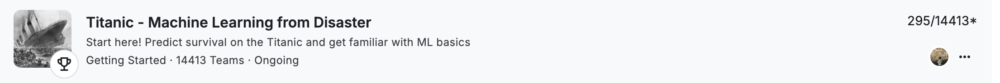

# Titanic - Machine Learning From Diaster

对Kaggle的[Titanic - Machine Learning From Diaster](https://www.kaggle.com/competitions/titanic) 项目进行建模和预测，本项目中使用了KNN，Random Forest, Logistic Regression等模型，对测试集的预测准确率达到82.775%, 在Kaggle竞赛中排名295/14413,排除前面排名中直接提交ground truth的队伍，这个预测准确率在真实排名中可达Top 1%

[Advanced_Feature_Engineering.ipynb](Advanced_Feature_Engineering.ipynb) ：最初对数据集的探索，使用Random Forest对数据集进行初步预测

[titanic_final.ipynb](titanic_final.ipynb) ： 这个笔记本是最终预测模型和预测结果
